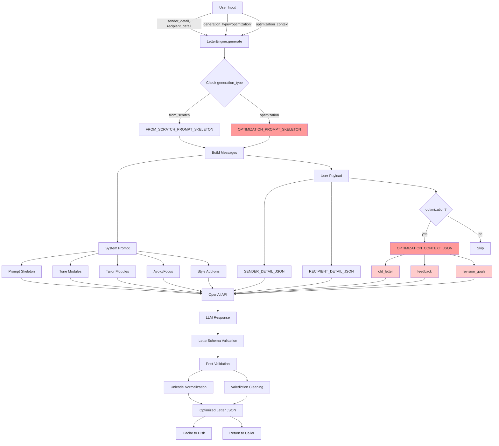

## Optimization Context Flow

```
┌─────────────────────────────────────────────────────────────────┐
│                    OPTIMIZATION CONTEXT                         │
├─────────────────────────────────────────────────────────────────┤
│                                                                 │
│  old_letter: {                                                  │
│    "recipient_name": "Dr. Jane Smith",                          │
│    "body": "I am writing to express my interest...",            │
│    ...                                                          │
│  }                                                              │
│                                                                 │
│  feedback: "The opening paragraph is too generic. Mention       │
│             specific research projects from your resume that    │
│             align with Prof. Smith's work on neural networks."  │
│                                                                 │
│  revision_goals: [                                              │
│    "strengthen research fit",                                   │
│    "add technical depth"                                        │
│  ]                                                              │
│                                                                 │
└─────────────────────────────────────────────────────────────────┘
                                 │
                                 ▼
┌─────────────────────────────────────────────────────────────────┐
│               OPTIMIZATION_PROMPT_SKELETON                      │
├─────────────────────────────────────────────────────────────────┤
│                                                                 │
│  1. Analyze old_letter                                          │
│  2. Parse feedback → "generic opening"                          │
│  3. Cross-reference sender_detail (profile/resume)              │
│  4. Find: "CNN project", "90% accuracy", "medical imaging"      │
│  5. Rewrite strategically:                                      │
│     - Replace generic → specific research project               │
│     - Add connection to Prof. Smith's neural network work       │
│  6. Validate: no fabrication, feedback addressed                │
│                                                                 │
└─────────────────────────────────────────────────────────────────┘
                                 │
                                 ▼
┌─────────────────────────────────────────────────────────────────┐
│                      LLM PROCESSING                             │
├─────────────────────────────────────────────────────────────────┤
│                                                                 │
│  BEFORE:                                                        │
│  "I am writing to express my interest in your program..."       │
│                                                                 │
│  AFTER:                                                         │
│  "I am writing to express my interest in joining your           │
│   research group, as your work on convolutional neural          │
│   networks for medical applications directly aligns with        │
│   my thesis project, where I developed a CNN-based classifier   │
│   that achieved 94% accuracy on breast cancer detection..."     │
│                                                                 │
└─────────────────────────────────────────────────────────────────┘
                                 │
                                 ▼
                         OPTIMIZED LETTER
```

## Revision Transformation Patterns

```
┌──────────────────────┐          ┌──────────────────────┐
│   FEEDBACK TYPE      │          │   AGENT ACTION       │
├──────────────────────┤          ├──────────────────────┤
│                      │          │                      │
│ "Too vague"          │─────────▶│ Add specifics from   │
│                      │          │ resume/profile       │
│                      │          │                      │
│ "Generic"            │─────────▶│ Tailor to target     │
│                      │          │ lab/program          │
│                      │          │                      │
│ "Weak evidence"      │─────────▶│ Add concrete         │
│                      │          │ metrics/outcomes     │
│                      │          │                      │
│ "Too long"           │─────────▶│ Remove redundancy,   │
│                      │          │ consolidate points   │
│                      │          │                      │
│ "Missing technical   │─────────▶│ Add tools/methods    │
│  depth"              │          │ from background      │
│                      │          │                      │
│ "Poor structure"     │─────────▶│ Reorganize for       │
│                      │          │ logical flow         │
│                      │          │                      │
└──────────────────────┘          └──────────────────────┘
```
